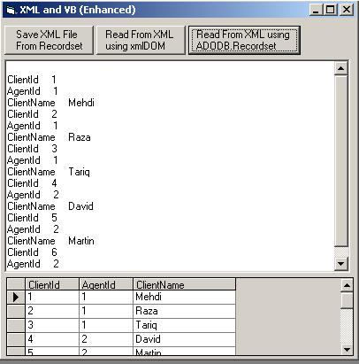



## XML and VB updated

### Description

This code will explore working of XML with VB. XML Supports rich set of classes for working with VB.
 
### More Info
 

             |
---                |---
**Submitted On**   |2007-04-24 10:53:08
**By**             |[M\.Mehdi](https://github.com/Planet-Source-Code/PSCIndex/blob/master/ByAuthor/m-mehdi.md)
**Level**          |Beginner
**User Rating**    |4.7 (14 globes from 3 users)
**Compatibility**  |VB 5\.0, VB 6\.0, ASP \(Active Server Pages\) 
**Category**       |[Coding Standards](https://github.com/Planet-Source-Code/PSCIndex/blob/master/ByCategory/coding-standards__1-43.md)
**World**          |[Visual Basic](https://github.com/Planet-Source-Code/PSCIndex/blob/master/ByWorld/visual-basic.md)
**Archive File**   |[XML\_and\_VB2062504272007\.zip](https://github.com/Planet-Source-Code/m-mehdi-xml-and-vb-updated__1-68445/archive/master.zip)

